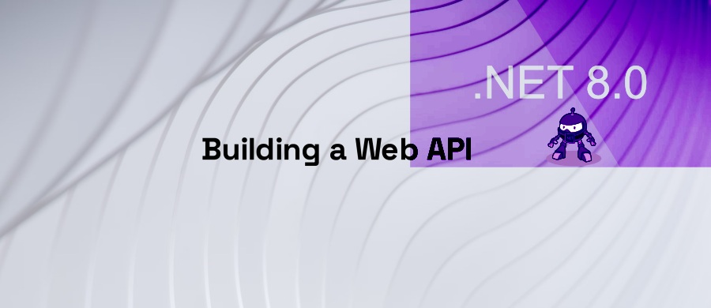

<h1 align="center">.NET 8 Web API</h1>

  
   
  <em>Building a Web API with .NET 8</em>
   

# Setup

The following tools are required to build and run this project:
 * [.NET 8 SDK](https://dotnet.microsoft.com/download/dotnet/8.0)
 * A Code editor like [Visual Studio Code](https://code.visualstudio.com/)
 * A browser of your choice that supports JavaScript and WebAssembly (so everything except Internet Explorer 11)

# What is in the box?
There are three projects in this repository:
 * **ExpenseTracker**: A .NET 8 Web API project that serves as the backend for the frontend project.
 * **Frontend**: A Blazor WebAssembly project that serves as the frontend for the Web API project.
 * **ExpenseTracker.Tests**: A .NET 8 xUnit project that contains unit tests for the Web API project (WebApplicationFactory).
  
The whole application is a simple Expense Tracker (CRUD application) that allows you to add, edit, delete and view expenses.
It uses a **SQLite** database to store the expenses (via Entity Framework Core) and **SignalR** to notify the frontend when the expenses are updated.

There are two branches:
 * **main**: Contains the final version of the application. So everything is already implemented.
 * **ui-only**: Contains the frontend project only. So you can implement the backend yourself.